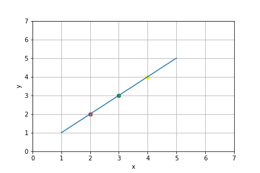
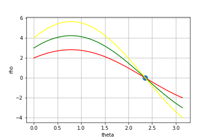
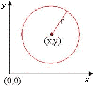

# Hough Transform with OpenCV

This repository is my journey exploring the Hough Circle Transform application using OpenCV and Python. You can check my implementation on the **code folder**.

## Hough Transform Theory

This transform is a feature extraction technique used in images to detect simple geometric forms that can be easily parameterized, such as lines, circles, or ellipses. 

For the desired geometric form, we define an equation to represent it. A line can be described as  <!-- $\rho = x*cos(\theta) + y*sin(\theta)$ --> . , for example, then the two parameters:  <!-- $\rho$ -->  and <!-- $\theta$ -->  defines a space of possibilities for our lines.

What the transform does is map every pixel on our image to a curve in the parameters space. If a point in this space is the intersection of many curves, there is a high probability it describes a line in the image.

### Example

Given an image:

We get pixels some pixels that are in the line and plot their representation on the parameters space. For this example, we will use the <!-- $\rho = x*cos(\theta) + y*sin(\theta)$ -->  representation:
	

The intersection point in this case is <!-- $\theta = \frac{3\pi}{2}$ -->  and <!-- $\rho = 0$ --> .

<!-- $$
\rho = x*cos(\theta) + y*sin(\theta
)$$ --> 

<!-- $$
0 = x*cos(\frac{3\pi}{2}) + y*sin(\frac{3\pi}{2})
$$ --> 

<!-- $$
x\frac{\sqrt{2}}{2} = y\frac{\sqrt{2}}{2}
$$ --> 

<!-- $$
x = y
$$ --> 

Being <!-- $x = y$ -->  the line present in our image

[Here](https://www.youtube.com/watch?v=ebfi7qOFLuo&ab_channel=octaviVision) you can check a visualization way better than my example.

### Others Geometric Forms

This idea extends to other geometric forms, you just have to change the equation that represents it. For a circle, you can define it by the following equation:

<!-- $$
(x-x_c)^2 + (y - y_c)^2 = r^2
$$ --> 

So, you have three parameters to find: <!-- $x_c$ --> , <!-- $y_c$ -->  and <!-- $r$ --> .

