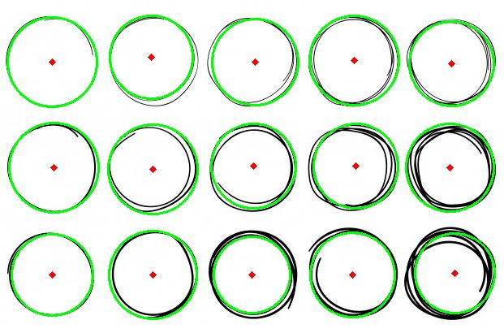
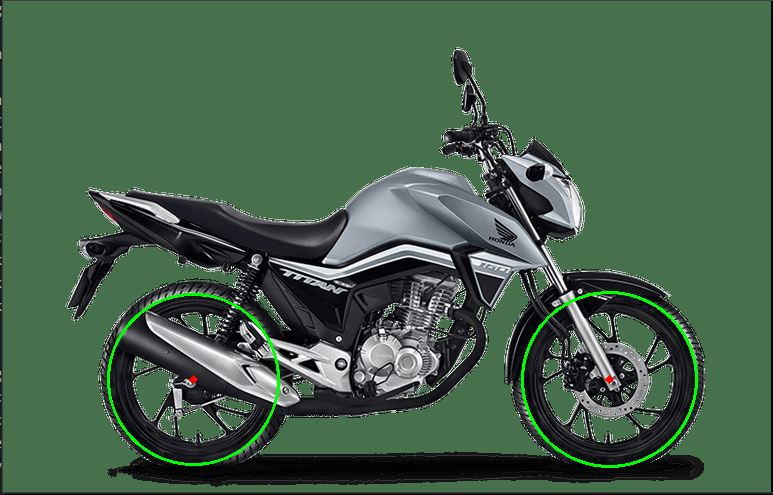
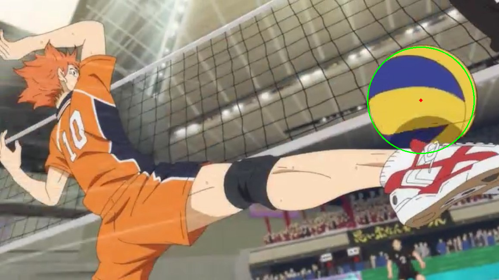

## cv2.HoughCircles()

This function has some tricky parameters to tune, and the perfect configuration doesn’t exist. Every kind of image has a different set of ideal parameters.

Here I'll explain the basics of this function, but you can always read the [oficial documentation](https://docs.opencv.org/3.4/dd/d1a/group__imgproc__feature.html#ga47849c3be0d0406ad3ca45db65a25d2d).

These function inputs are:

*  *image*: single channel, greyscale input image.
*  *method*: the technique used to detect the circles. The only implemented method is [**cv.HOUGH_GRADIANT**](http://www.bmva.org/bmvc/1989/avc-89-029.pdf).
*  *dp*: Basically, it defines the size of your accumulator, a bigger value leads to a bigger accumulator and higher probability of false detections.
* *minDist*: minimal distance between the center of two detected circles. If it's too low, you may detect more than one circle in the same place due to imperfections on the image.
* *param1*: This is the second parameter of the internal Canny filter in the HOUGH_GRADIANT method, the first one is half of it. You can play with Canny outside this function to tune this attribute.
* *param2* : This is the threshold of the accumulator, the higher this parameter, the fewer circles will be detected, but if it's too low you may detect false positives.

### Pre-processing

This function *likes* circles no filled, so you can help it in many ways.

**Treating the channels alone**

If you are trying to detect circles in a specific color, you can try highlighting this color. Changing the contrast or the brightness of some channels before making it greyscale can help with that. Another approach is detecting circles in every channel apart and then combining the results, so you don't lose too much color information.

**Reducing the level of details**

The Canny filter does a lot to reduce the image complexity, but you can use some morphologic transformations to make the image simpler and with distinguishable circles. Erosion, Dilatation, Opening, Close, are some examples that can help you. Check [their definitions](https://opencv-python-tutroals.readthedocs.io/en/latest/py_tutorials/py_imgproc/py_morphological_ops/py_morphological_ops.html) to choose what to use.

---
## Results

  
   
  

## Implementation

To install the dependencies for this project you can run:

`
$ pip install -r requirements.txt
`

## Running from terminal

If you want an env to play with the Hough Circle Transform you can use:

`
$ python utils -i path/to/image
`

This will open an OpenCV GUI with sliders to change some parameters

The right one is the post-processed one, with canny included, so you can see what is the impact of your pre-processing

