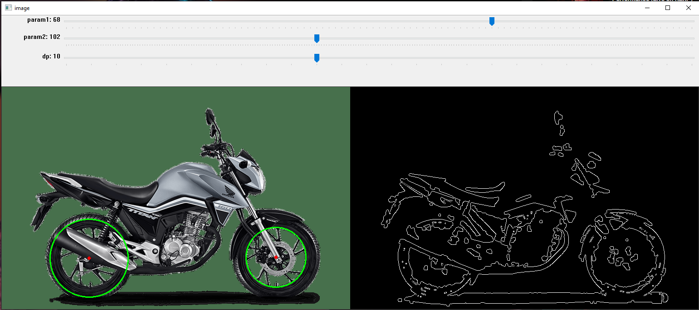

# Implementation

To install the dependences for this project you can run:

`
$ pip install -r requirements.txt
`

## Running from terminal

If you want an env to play with the Hough Circle Transform you can use:

`
$ python main -path path/to/image
`

This will open an OpenCV GUI with sliders to chage the parameters

